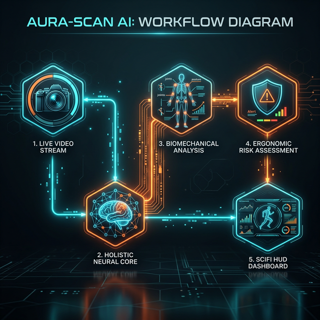
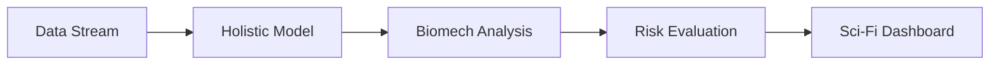

# 🧬 Aura-Scan AI: Technical Source of Truth

> [!IMPORTANT]
> **Mission**: Transforming industrial safety through local-first, high-fidelity biomechanical intelligence. Aura-Scan is a "hackathon-ready" prototype designed to look and feel like a professional research tool.

---

## 🚀 Advanced Feature Suite

- **Holistic 75-Point Tracking**: Simultaneous 33-point body pose + 21-point dual-hand tracking for total body kinetic analysis.
- **Biomechanical "Digital Twin"**: Real-time modeling of skeletal vectors, including spine curvature and joint torque.
- **Gait Symmetry Node**: Advanced analysis of stride length, cadence, and stability index (Proprioceptive Health).
- **Proactive Risk Engine**: Temporal analysis (30-frame buffer) to detect increasing risk trends before they become injuries.
- **Futuristic SC-HUD**: A "Sci-Fi HUD" featuring motion trails, heatmap glows, and dynamic skeleton coloring.
- **Industrial Safety Protocols**: Hard-coded thresholds (REBA/RULA derived) for high-impact repetitive environments.

---

## 🛠️ Tech Stack & Model Selection

| Layer | Tool / Model | Rationale | Why it's the "Best" |
| :--- | :--- | :--- | :--- |
| **Logic Node** | **Streamlit** | Immediate reactive UI for live data streams. | Faster than React/Vue for AI-heavy Python tools. |
| **Neural Core** | **MediaPipe BlazePose** | Sub-millisecond inference on a laptop CPU. | Superior tracking stability vs OpenPose on CPU. |
| **Tactile Engine** | **MediaPipe Hands** | 21 3D-points per hand; essential for wrist/finger stress detection. | Zero-latency holistic integration. |
| **Visual Node** | **OpenCV HUD** | High-performance frame-by-frame alpha blending for scifi effects. | Industry standard for real-time video overlay. |
| **Math Engine** | **NumPy / SciPy** | Vectorized biomechanics (Torque/Angles) calculations. | Necessary for real-time 30FPS processing. |

---

## 🧬 System Workflow

---

## 🔍 How AURA-SCAN Detects Problems

Aura-Scan doesn't just "see"—it **calculates**. It identifies three primary "Red Zones":

1. **Kyphotic Spine Stress**: Measures the segment angle between the shoulders (11, 12) and hips (23, 24). If local curvature exceeds safe limits, the HUD triggers a **SPINE ALERT**.
2. **Kinetic Gait Imbalance**: Compares the Euclidean distance of ankle travel over time. Significant variance (>15%) identifies limping or walking instability.
3. **Knee Torque Overload**: Approximates the mechanical load on the patellar region based on leg extension angles. High torque (Torque = Force x Lever Arm) is highlighted with a **Heatmap Glow**.

---

## 🔮 The Future: Post-Hackathon Roadmap

- **🔥 Thermal Signature Integration**: Mapping real-time IR data to joint coordinates to identify inflammation "hot-spots" before physical symptoms appear.
- **♿ Adaptive Biomechanical Learning**: Implementing **Personalized Baselines**. The system will learn the "Normal" movement of individuals with physical disabilities to ensure risk assessment is inclusive and accurate for all workers.
- **📍 Multi-Node Factory Sync**: A centralized dashboard to monitor 100+ workers in real-time across a localized network.
- **🧠 Predictive Fatigue Modeling**: Using LSTM (Long Short-Term Memory) networks to predict injury windows 2 hours in advance.

---
**DESIGNED FOR THE FUTURE OF WORK // AI STATUS: OPTIMAL**
